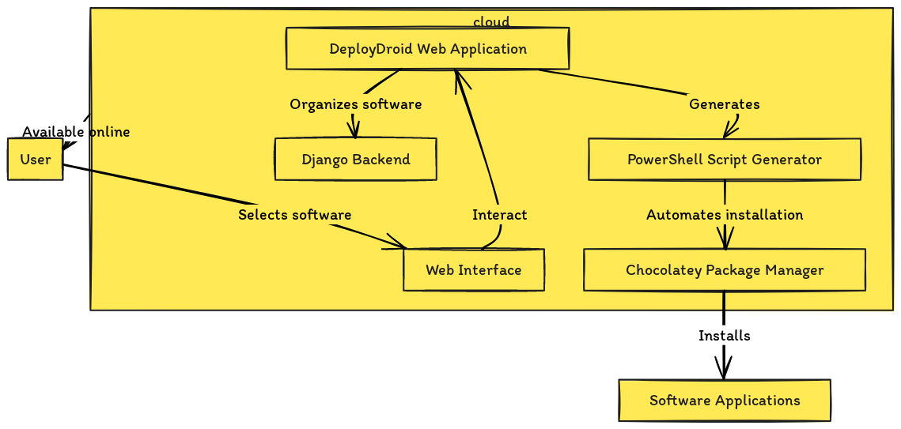

# 🚀 DeployDroid: The Ninite Killer 🎯

Hey there! 👋 Welcome to **DeployDroid**, the ultimate tool that's about to make Ninite look like it's from the Stone Age. 🪓 We're here to revolutionize the way you install software on Windows. Forget the old days of downloading and installing your favorite apps one by one. 🐢💤 With DeployDroid, you’re entering the express lane on the software installation highway! 🏎️💨

## Why DeployDroid? 🤔

- **Bulk Installs? Easy Peasy**: Select your apps, hit install, and watch the magic happen. 🧙‍♂️✨
- **Up-to-Date, Always**: Say goodbye to outdated apps. DeployDroid keeps you in the loop with the latest versions. 🔄🆕
- **Categorically Organized**: Whether you're a Gamer 🎮, Developer 👩‍💻, or Artist 🎨, we've got your software needs sorted.
- **Zero Bloatware**: Get what you want, and nothing more. No sneaky toolbars or unwanted extras. 🚫🔍

## Help us Build The Website 🏁

To kick things off with DeployDroid, just follow these steps and you'll be on your way to an effortlessly maintained software library:

1. **Clone This Repo**: `git clone https://github.com/bdr-pro/DeployDroid.git`
2. **Navigate to DeployDroid**: `cd DeployDroid`
3. **Launch It**: Follow the instructions in our [Setup Guide for DeployDroid](#setup-guide-for-deploydroid) to get DeployDroid up and running.

It's that simple! For more detailed instructions, check out our *Wiki*

## Features 🔥

- **Slick User Interface**: With our intuitive UI, finding and installing your essential apps is a breeze. 🌬️🍃
- **Massive Library**: Access to a vast repository of software, from essentials to niche tools. 📚🔍
- **Custom Lists**: Create your own software suites and share them with friends or the community. 🤝💼

## Contributing 🤲

Got an idea to make DeployDroid even more awesome? Found a bug that needs squashing? Jump in and contribute! Check out our [contributing guidelines](#contributing-guideline-for-deploydroid) for how to proceed.

## Support Us 💖

Loving DeployDroid? Spread the word and star us on GitHub! Want to go further? starts and share the repo with your friends and family. 🌟👨‍👩‍👧‍👦

## Follow Us 📱

Stay updated with the latest DeployDroid news and updates:

## TODO: Add social media links

    - **Twitter**: [@DeployDroid](#)
    - **Instagram**: [@DeployDroid](#)

## License 📄

DeployDroid is made available under the [MIT License](LICENSE). Feel free to use, modify, and distribute it as you see fit.

## A Parting GIF 🎬

Because we all need a good laugh, here's a GIF that perfectly encapsulates the DeployDroid experience: **TODO**


---

### Setup Guide for DeployDroid

Welcome to the fast track to getting DeployDroid up and running on your machine! 🚀 This guide assumes you have a basic understanding of Python and Django. If you're new to Django, no worries! It's a friendly framework for beginners and there are plenty of resources out there to get you started.

#### Prerequisites

Before we dive in, make sure you've got the following ready:

- Python (3.8 or later)
- pip (Python Package Installer)
- Virtual environment (optional but recommended)

#### Step 1: Clone the Repository

First things first, grab the code:

    ```bash
    git clone https://github.com/bdr-pro/DeployDroid.git
    cd DeployDroid
    ```

#### Step 2: Set Up Your Virtual Environment

To keep things tidy, let's create a virtual environment:

    ```bash
    python -m venv myenv
    ```

Activate it:

- On Windows: `myenv\Scripts\activate`
- On MacOS/Linux: `source myenv/bin/activate`

#### Step 3: Install Dependencies

With your virtual environment activated, install the required packages:

    ```bash
    pip install -r requirements.txt
    ```

#### Step 4: Initialize the Database

Let's set up the database:

    ```bash
    python manage.py makemigrations
    python manage.py migrate
    ```

#### Step 5: Run the Server

You're almost there! Start the Django development server:

    ```bash
    python manage.py runserver
    ```

Open your favorite browser and visit `http://127.0.0.1:8000/` to see DeployDroid in action! 🎉

### Contributing Guideline for DeployDroid

Hey there, future contributor! 🌟 We're thrilled you're interested in helping DeployDroid grow. Here's how you can contribute:

#### 🐞 Reporting Bugs

Stumbled upon a bug? Let us know through the Issues tab, providing as much detail as possible. Screenshots and step-by-step instructions to reproduce the issue are golden!

#### 💡 Suggesting Enhancements

Got an idea to make DeployDroid even better? We're all ears! Share your thoughts with us via Issues.

#### 🚀 Submitting Changes

Ready to dive in and code? Follow these steps:

1. **Fork the Repository**: Navigate to the DeployDroid GitHub page and click on the "Fork" button. This creates a copy of the repository in your GitHub account.

2. **Clone Your Fork**: Get a local copy of your fork using `git clone`.

3. **Create a New Branch**: Before making changes, switch to a new branch with a descriptive name for your changes.

4. **Make Your Changes**: Implement your feature or fix that bug. Don't forget to keep your code clean and well-documented!

5. **Commit Your Changes**: Write a clear, concise commit message. Include emojis if you like! 😄

6. **Push to Your Fork**: Upload your changes to GitHub.

7. **Submit a Pull Request (PR)**: Go to the original DeployDroid repository you forked; you'll see a prompt to submit a pull request. Fill in the details, explaining the changes you've made. Link any relevant issues.

8. **Review**: One of our core contributors will review your changes. Be open to feedback and ready for some back-and-forth on your code if needed.

And that's it! We strive to keep the contribution process as smooth as possible, but we're always looking for ways to improve it. Happy coding, and thank you for contributing to DeployDroid! 🚀💻

Here's a graph diagram illustrating the DeployDroid web application, highlighting its components and interactions:



- **User Interaction**: Users select software through a web interface.
- **Web Application Structure**: Includes the Django backend for software organization and a PowerShell script generator for automating the installation process.
- **External Components**: Utilizes Chocolatey for software installation.
- **Cloud-Based Operation**: Illustrates the application's components as part of an online service accessible to users.

---
